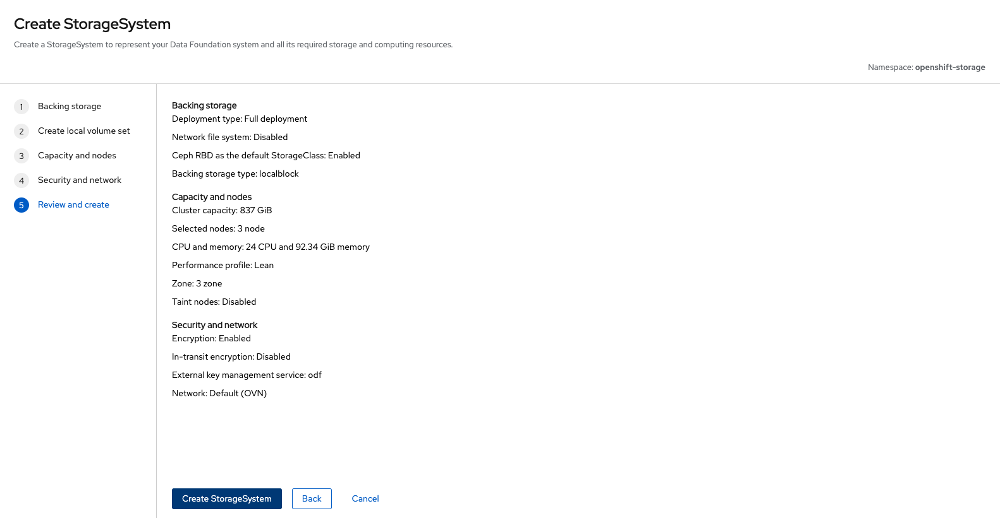

# **ODF Cluster-Wide Encryption with HashiCorp Vault KMS**

## **Introduction**

Managing secrets securely is becoming increasingly a non-negotiable for many enterprises today across cloud and on-prem environments. With IBM’s recent acquisition of HashiCorp, organizations are now poised to take advantage of deeper integration opportunities between HashiCorp Vault and Red Hat OpenShift, strengthening their security posture.

In this article, we’ll walk through the integration of OpenShift Data Foundation (ODF) with HashiCorp Vault to enable cluster-wide encryption using Vault as a Key Management System (KMS). This demo will be deployed on AWS using local devices as the backing store to the ODF cluster.

## **Deploying Vault on OpenShift**

While many enterprises use an **external Vault instance**, for demo purposes, we will deploy Vault **within the OpenShift cluster** using Helm. The Vault instance will:

- Be deployed via **Helm** with TLS certificates managed by **cert-manager** ([here](https://cert-manager.io/docs/configuration/vault/) is a great guide to walk you through that).
- The TLS certs will be created with a **locally generated root CA**

### **1. Initialize Vault**

Once Vault is running, initialize it. You can either do these series of steps by executing each command with an `oc exec` wrapper or simply obtaining your tokens and running `oc exec -ti vault-0 -n vault -- sh` to run everything within the Vault shell.

```sh
$ oc exec vault-0 -- vault operator init -key-shares=1 -key-threshold=1 -format=json > init-keys.json
```
This command generates **unseal keys** and a **root token**. Make sure to store them securely. You'll often be prompted to unseal Vault.

Unseal Vault with:
```sh
$ cat init-keys.json | jq -r ".unseal_keys_b64[]"
hmeMLoRiX/trBTx/xPZHjCcZ7c4H8OCt2Njkrv2yXZY=
```
```sh
$ VAULT_UNSEAL_KEY=$(cat init-keys.json | jq -r ".unseal_keys_b64[]")
$ oc exec vault-0 -- vault operator unseal $VAULT_UNSEAL_KEY
```
```sh
$ cat init-keys.json | jq -r ".root_token"
s.XzExf8TjRVYKm85xMATa6Q7U
$ VAULT_ROOT_TOKEN=$(cat init-keys.json | jq -r ".root_token")
```

```sh
oc exec vault-0 -- vault login $VAULT_ROOT_TOKEN

Success! You are now authenticated. The token information displayed below
is already stored in the token helper. You do NOT need to run "vault login"
again. Future Vault requests will automatically use this token.

Key                  Value
---                  -----
token                s.P3Koh6BZikQPDxPSNwDzmKJ5
token_accessor       kHFYypyS2EcYpMyrsyXUQmNa
token_duration       ∞
token_renewable      false
token_policies       ["root"]
identity_policies    []
policies             ["root"]
```

### **2. Configure Vault for Kubernetes Auth and enable the KV backend path**

```sh
oc -n vault exec pods/vault-0  -- \
        vault auth enable kubernetes

oc -n vault exec pods/vault-0  -- \
        vault secrets enable -path=odf kv-v2
```
## A note on ODF Vault roles 

The official ODF documentation recommends creating a `odf-vault-auth` service account in the `openshift-storage` namespace with an auth delegator role. This role allows Vault to authenticate against the OpenShift **TokenReview API** by using a long-lived service account token (`token_reviewer_jwt`).

- For this demo, instead of introducing a dedicated service account (SA) for delegation, we have bound the authentication role directly to the existing operator-managed service accounts. While keeping the token authentication process separate from the ODF operator’s service accounts is generally recommended in typical organizations for better access control flexibility, this adjustment simplifies our setup.
- The `odf-rook-ceph-op` role in Vault is bound to the `rook-ceph-system` SA. This SA is used by the Rook-Ceph operator when creating OSD encryption keys in Vault.

From v1.22, Kubernetes discourages the use of [long-lived SA tokens](https://kubernetes.io/docs/concepts/configuration/secret/#serviceaccount-token-secrets) and recommends using short-lived tokens via the TokenRequest API. We align with this best practice by setting a short TTL in the Vault role policy, ensuring tokens are automatically rotated on the Vault side.

### **3. Configure Vault Roles**

```sh
oc -n vault exec pods/vault-0  -- \
        vault write auth/kubernetes/role/odf-rook-ceph-op \
        bound_service_account_names=rook-ceph-system,rook-ceph-osd,noobaa \
        bound_service_account_namespaces=openshift-storage \
        policies=odf \
        ttl=5m

oc -n vault exec pods/vault-0 -- \
        vault write auth/kubernetes/role/odf-rook-ceph-osd \
        bound_service_account_names=rook-ceph-osd \
        bound_service_account_namespaces=openshift-storage \
        policies=odf \
        ttl=5m
```

### **4. Configure the K8s authentication method to use location of the Kubernetes API**

Note: If Vault is hosted on kubernetes, `kubernetes_ca_cert` can be omitted from the config of a Kubernetes Auth mount. 

```sh
oc -n vault exec pods/vault-0  -- \
    vault write auth/kubernetes/config \
    kubernetes_host="https://kubernetes.default.svc:443"
```

### **5. Create an ACL Policy**

```sh
oc -n vault exec -i pods/vault-0 -- vault policy write odf - <<EOF
path "odf/*" {
  capabilities = ["create", "read", "update", "delete", "list"]
}
path "sys/mounts" {
  capabilities = ["read"]
}
EOF
```

## **Deploying ODF Storage Cluster with KMS Cluster-Wide Encryption**

Now with Vault all configured, we're ready to head over to the OpenShift console and step through the ODF wizard to get our storage cluster up.

Get to the stage where you've installed both the Local Storage Operator (LSO) and the OpenShift Data Foundation Operator via Operator Hub.

### **1. Create the auth-delegator `ClusterRoleBinding`**

```sh
oc -n openshift-storage create clusterrolebinding vault-tokenreview-binding --clusterrole=system:auth-delegator --serviceaccount=openshift-storage:rook-ceph-system
```

### **2. Create the ODF StorageSystem**

With the Operators deployed, select `Create StorageSystem` in figure below to get to the ODF configuration screen.


You will then be presented with the `StorageSystem` wizard. By opting for local devices, the LSO will kick off a discovery of our drives.


On the next screen, we'll set our `LocalVolumeSet` and `StorageClass` name. The selected capacity confirmed that all our disks have been picked up correctly. Hit **Confirm** to create the LVS.


```sh
$ oc get localvolumeset -A
NAMESPACE                 NAME          AGE
openshift-local-storage   local-block   3m7s
```

Once our localblock-backed PVs have been provisioned we can view the target hosts for the ODF cluster. For this demo, we will select a performance profile of **Lean**.


In this screen, we'll set up everything we need for KMS integration with Vault. 

By default, Kubernetes is used as the authentication method. Enter a **Connection name** — "odf" is a suitable choice, as we're configuring this specifically for ODF.

Provide the address of the Vault cluster. Since the deployment is within the cluster, you can use the Service address along with the default Vault Port, 8200.


Go ahead and select *Advanced settings*. In line with our Vault settings we configured earlier, set the Backend and Authentication path to `odf` and `kubernetes`, respectively. Then upload the Root CA that was used to issue your cert-manager (or other) issuer backed Vault certificates. This will generate a secret in the `openshift-storage` namespace.


Under *Review and create*, select `Create StorageSystem`.



The OCS Operator should spawn a `csi-kms-ca-secret-<hash>` and `ocs-kms-ca-secret-<hash>` K8s secret (if it doesn't immediately, delete the pod and let it recreate). Additionally, two key ConfigMaps containing the KMS connection details should also be present in the `openshift-storage` namespace. Inspect their contents to verify all the relevant data you inputted via the ODF console is all there. 

They should resemble something like the below:

```yaml
kind: ConfigMap
apiVersion: v1
metadata:
  name: csi-kms-connection-details
  namespace: openshift-storage
data:
  odf: '{"encryptionKMSType":"vaulttenantsa","kmsServiceName":"odf","vaultAddress":"https://vault.vault.svc:8200","vaultBackendPath":"odf","vaultCAFromSecret":"csi-kms-ca-secret-yai05r68","vaultTLSServerName":"","vaultCAFileName":"my-root-ca.pem","vaultClientCertFileName":"","vaultClientCertKeyFileName":"","vaultAuthMethod":"kubernetes","vaultAuthPath":"kubernetes","vaultAuthNamespace":"","vaultNamespace":""}'
```

```yaml
kind: ConfigMap
apiVersion: v1
metadata:
  name: ocs-kms-connection-details
  namespace: openshift-storage
data:
  KMS_SERVICE_NAME: odf
  VAULT_AUTH_KUBERNETES_ROLE: odf-rook-ceph-op
  VAULT_AUTH_METHOD: kubernetes
  VAULT_NAMESPACE: ''
  VAULT_CACERT: ocs-kms-ca-secret-pzm5nwjd
  VAULT_AUTH_MOUNT_PATH: kubernetes
  VAULT_TLS_SERVER_NAME: ''
  VAULT_BACKEND_PATH: odf
  VAULT_ADDR: 'https://vault.vault.svc:8200'
  KMS_PROVIDER: vault
```

You can tail the logs of the rook-ceph operator pod to check for any errors. However, the ultimate test is to verify that the encryption keys have been created in the backend path in Vault.

```sh
$ oc -n vault exec vault-0 -- vault kv list odf
Keys
----
rook-ceph-osd-encryption-key-ocs-deviceset-localblock-0-data-0xlflh
rook-ceph-osd-encryption-key-ocs-deviceset-localblock-1-data-0vzjf7
rook-ceph-osd-encryption-key-ocs-deviceset-localblock-2-data-0xc84g
```

Or in the Vault console.


With these present in Vault, you should now see the OSD pods come up.

```sh
$ oc get pod -l app=rook-ceph-osd
NAME                               READY   STATUS    RESTARTS   AGE
rook-ceph-osd-0-84755dcfbc-jsfhk   2/2     Running   0          92s
rook-ceph-osd-1-bb58bf7f6-qzsb4    2/2     Running   0          90s
rook-ceph-osd-2-54d85d8b55-kz6hd   2/2     Running   0          84s
```

And there we have it. The ODF cluster is complete and ready for use, with the following storage classes available for PV consumption on the cluster.

```sh
$ oc get sc
NAME                                    PROVISIONER                             RECLAIMPOLICY   VOLUMEBINDINGMODE      ALLOWVOLUMEEXPANSION   AGE
gp2-csi                                 ebs.csi.aws.com                         Delete          WaitForFirstConsumer   true                   7h2m
gp3-csi (default)                       ebs.csi.aws.com                         Delete          WaitForFirstConsumer   true                   7h2m
localblock                              kubernetes.io/no-provisioner            Delete          WaitForFirstConsumer   false                  34m
ocs-storagecluster-ceph-rbd (default)   openshift-storage.rbd.csi.ceph.com      Delete          Immediate              true                   7m26s
ocs-storagecluster-cephfs               openshift-storage.cephfs.csi.ceph.com   Delete          Immediate              true                   7m56s
openshift-storage.noobaa.io             openshift-storage.noobaa.io/obc         Delete          Immediate              false                  4m39s
```

---

## **Conclusion**

Integrating ODF with HashiCorp Vault gives you a secure, centralized way to manage encryption for your data at rest. Whether you're using Vault as your KMS or looking to enhance security with HSM-backed key storage, there's a lot of flexibility in how you approach the setup. Vault’s policies also allow for fine-grained access control, ensuring that only the right services can access your sensitive data - we can imagine a world in which certain industries require this more than others. 

This guide covers the basics, but the true value of this setup lies in its flexibility to adapt to your organization's specific needs. ODF Encryption doesn’t stop at cluster-wide encryption for OSDs; you can also configure what I would loosely reference as "double encryption". This involves encrypting not only the cluster-wide storage but also individual StorageClass-level encryption, where PVs are encrypted at-rest, at the namespace level, really locking things down. 
